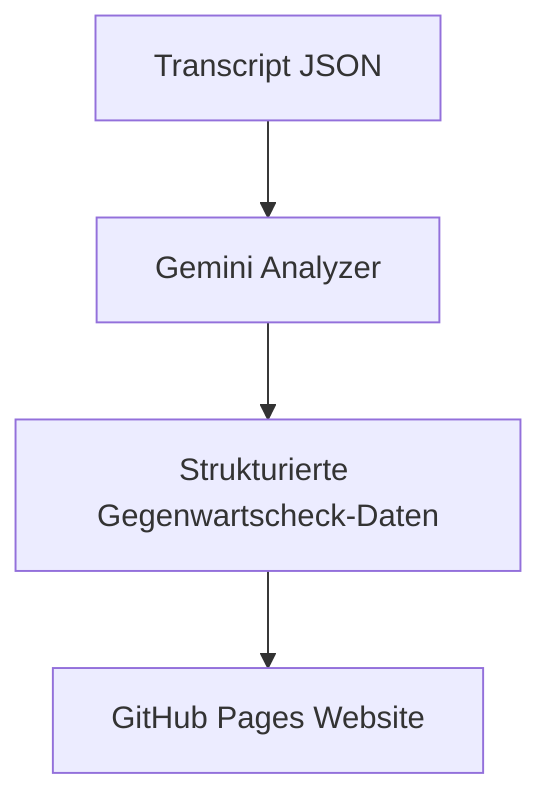

# Gegenwartscheck Gemini Analyzer

Diese Spezifikation beschreibt den automatisierten Prozess zur Extraktion strukturierter Daten aus den Podcast-Transkripten der "Dies sogenannte Gegenwart" Sendungen mithilfe der Gemini API.

## Überblick

Der Gemini Analyzer ist ein wichtiger Bestandteil des Workflows zur Verarbeitung von Podcast-Transkripten. Er analysiert die JSON-Transkriptdateien, identifiziert die "Gegenwartscheck"-Segmente und extrahiert strukturierte Daten zu den einzelnen Vorschlägen und deren Bewertung.



## Workflow: Gemini Analyzer

**Datei:** `.github/workflows/gemini-analyzer.yml`

**Zweck:** Die mit Gemini API analysierten Transkripte werden genutzt, um strukturierte Daten über die "Gegenwartscheck"-Segmente zu extrahieren.

**Schlüsselkomponenten:**
- Wird nach dem Hinzufügen neuer Transkript-Dateien oder manuell ausgelöst
- Verarbeitet alle vorhandenen Transkripte oder nur neue (konfigurierbar)
- Verwendet die Gemini API zur semantischen Analyse der Transkripte
- Extrahiert strukturierte Daten und speichert sie im JSON-Format
- Committet die Daten in das Repository

**Umgebungsanforderungen:**
- Läuft auf Ubuntu
- Benötigt Python und den Gemini API-Schlüssel als GitHub Secret

## Dateneingabe

Die Eingabe für den Analyzer sind die JSON-Transkriptdateien im `/data/transcripts`-Verzeichnis mit der Struktur:

```json
{
  "episode_title": "Episode Titel",
  "podcast_id": "12345",
  "extracted_date": "2023-01-01T12:00:00",
  "transcript": [
    {
      "speaker": "Speaker Name",
      "text": "Gesprochener Text..."
    }
  ]
}
```

## Datenausgabe

Die Ausgabe ist eine JSON-Datei pro Episode im `/data/analyses`-Verzeichnis mit der Struktur:

```json
{
  "episode_title": "Episode Titel",
  "podcast_id": "12345",
  "episode_date": "2023-01-01",
  "extracted_date": "2023-01-05T12:00:00",
  "gegenwartsvorschlaege": [
    {
      "vorschlag": "Name des Gegenwartsvorschlags",
      "vorschlagender": "Nina/Lars/Ijoma/[Name des Hörers]",
      "ist_hoerer": true/false,
      "hoerer_name": "Name des Hörers (falls vorhanden)",
      "begruendung": "Begründung für den Vorschlag",
      "metaebene": "Metaebene (falls explizit erwähnt)",
      "punkt_erhalten": true/false,
      "punkt_von": "Nina/Lars/Ijoma",
      "tags": ["Tag1", "Tag2", "Tag3"]
    }
  ]
}
```

## Prompt-Design für Gemini

Der Prompt für die Gemini API muss sorgfältig gestaltet werden, um die relevanten Informationen zu extrahieren. Der Prompt sollte:

1. Die Regeln des "Gegenwartscheck"-Spiels erklären
2. Die zu extrahierenden Informationen klar definieren
3. Das gewünschte Ausgabeformat spezifizieren
4. Beispiele für die Extraktion enthalten

Der Prompt wird auf Deutsch gestellt, da die Transkripte auf Deutsch sind und die Ausgabe ebenfalls auf Deutsch sein soll.

## Implementation

Das Python-Skript für den Analyzer wird:

1. Alle Transkript-JSON-Dateien im `/data/transcripts`-Verzeichnis durchsuchen
2. Den Prompt dynamisch mit dem Transkriptinhalt generieren
3. Die Gemini API aufrufen und die Antwort verarbeiten
4. Die strukturierten Daten validieren und bereinigen
5. Die Ergebnisse im JSON-Format speichern
6. Die Daten in das Repository committen

## TODO / Offene Punkte

1. Feinabstimmung des Prompts für optimale Ergebnisse
2. Behandlung von Sonderfällen (z.B. mehrere Gegenwartsvorschläge gleichzeitig)
3. Umgang mit potenziellen API-Limits oder -Fehlern
4. Tests mit verschiedenen Transkripten zur Validierung der Extraktionsgenauigkeit
5. Integration in den bestehenden GitHub Actions Workflow
6. Visualisierung der extrahierten Daten auf der GitHub Pages-Website 