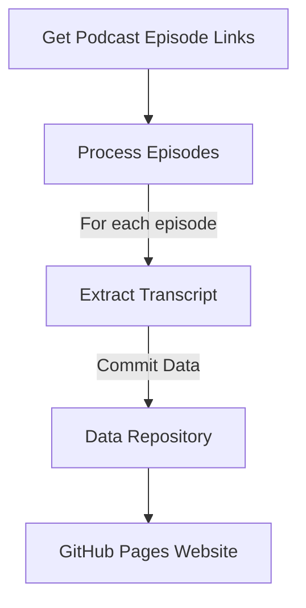

# Gegenwartscheck Transcript Processor

This document outlines the technical specification for the automated podcast transcript extraction system for the "Dies sogenannte Gegenwart" podcast's "Gegenwartscheck" segments.

## Workflow Overview

The system consists of three interconnected GitHub Actions workflows that coordinate to:

1. Fetch podcast episode links from Apple Podcasts
2. Process each episode to trigger transcript viewing in the Podcasts app
3. Extract and store the transcript data



## Workflow 1: Get Podcast Episode Links

**File:** `.github/workflows/get-podcast-links.yml`

**Purpose:** Fetch episode links from Apple Podcasts API for episodes with "Gegenwartscheck" in the title.

**Key Components:**
- Triggered weekly or manually
- Uses iTunes Search API to find podcast episodes
- Filters for episodes containing "gegenwartscheck" in the title
- Stores episode links as JSON artifact and workflow output
- Currently limited to 5 episodes for testing

**Output:** 
- `episode_links.json` containing episode titles and URLs

## Workflow 2: Process Episodes

**File:** `.github/workflows/process-episodes.yml`

**Purpose:** Process each podcast episode to view the transcript, making it available in the cache.

**Key Components:**
- Triggered by completion of "Get Podcast Episode Links" workflow or manually
- Downloads episode links from previous workflow
- Uses matrix strategy to process each episode
- Uses AppleScript to:
  - Launch Podcasts app
  - Open specific episode
  - Navigate UI to view transcript
- Zips and uploads the podcast cache folder as an artifact
- Triggers the Extract Transcript workflow for each episode

**Environment Requirements:**
- Runs on macOS runner
- Requires Apple Podcasts app

## Workflow 3: Extract Transcript

**File:** `.github/workflows/extract-transcript.yml`

**Purpose:** Parse TTML files to extract transcript content and save as structured data.

**Key Components:**
- Triggered by the Process Episodes workflow
- Downloads cache artifact containing TTML files
- Parses TTML files using BeautifulSoup
- Extracts speaker information and dialogue text
- Saves transcript as structured JSON
- Commits data to repository

**Output:**
- JSON files in `/data` directory with structure:
  ```json
  {
    "episode_title": "Episode Title",
    "podcast_id": "12345",
    "extracted_date": "2023-01-01T12:00:00",
    "transcript": [
      {
        "speaker": "Speaker Name",
        "text": "Spoken text content..."
      }
    ]
  }
  ```

## TODO / Open Issues

1. Implement transcript analysis for "Gegenwartscheck" data extraction
2. Create GitHub Pages website to visualize the extracted data
3. Add error recovery mechanisms for workflow failures
4. Optimize AppleScript interaction with Podcasts app for better reliability
5. Create documentation for using the extracted data
6. Consider adding a manual override for specific episodes 